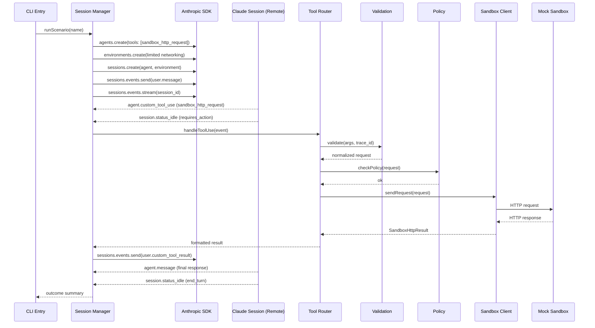

# Design: Claude Managed Agents HTTP Tool Sandbox

## Overview

This recipe demonstrates how to connect Claude Managed Agents to the shared `sandbox_http_request` contract via the custom tool integration pattern. The agent declares `sandbox_http_request` as a custom tool; when invoked, the session emits an `agent.custom_tool_use` event, pauses, and waits for the client to execute the tool externally and return the result as a `user.custom_tool_result` event.

The recipe reuses the sandbox HTTP client, mock server, policy, validation, and logger modules from the generic recipe. The new code is the Claude-specific orchestration layer: agent/environment/session lifecycle management, SSE event handling, and result formatting for the custom tool protocol.

**Beta Status:** Claude Managed Agents requires the `managed-agents-2026-04-01` beta header. The `anthropic` SDK sets this automatically via `client.beta.*`. This recipe targets a beta API that may change.

## Architecture



### Key Architecture Decisions

1. **Custom tool executes client-side.** Claude's cloud sandbox runs built-in tools (bash, file ops). Our `sandbox_http_request` is a custom tool that executes in the client process, not inside Claude's sandbox. The environment's `allowed_hosts` demonstrates the concept but the real enforcement is our local policy module.

2. **Reuse shared modules verbatim.** The `contract.ts`, `validation.ts`, `policy.ts`, `sandbox-client.ts`, `mock-sandbox.ts`, and `logger.ts` files are direct copies from the generic recipe. This ensures cross-vendor comparison stays fair and behavior is identical.

3. **Event-driven, not callback-driven.** Unlike the generic recipe's synchronous agent loop, this recipe uses SSE streaming with explicit state detection (`requires_action` → execute → send result → resume).

4. **Session ID as trace anchor.** The Claude session ID becomes the `session_id` in trace context. The `agent.custom_tool_use` event ID becomes the `tool_call_id`.

## Components and Interfaces

### File Structure

```
examples/claude-managed-agents/http-tool-sandbox/
├── src/
│   ├── index.ts              # CLI entry point
│   ├── session-manager.ts    # Agent/environment/session lifecycle + event loop
│   ├── tool-router.ts        # Routes custom_tool_use → validation → policy → client
│   ├── result-formatter.ts   # Formats SandboxHttpResult → custom_tool_result content
│   ├── config.ts             # Env var loading (.env support)
│   ├── scenarios.ts          # Demo scenario definitions
│   ├── contract.ts           # [COPIED] Shared types and error codes
│   ├── validation.ts         # [COPIED] Argument validation
│   ├── policy.ts             # [COPIED] URL/method allowlist
│   ├── sandbox-client.ts     # [COPIED] HTTP client with timeout/size limits
│   ├── mock-sandbox.ts       # [COPIED] Local mock HTTP server
│   └── logger.ts             # [COPIED] Structured JSON logging
├── test/
│   └── sandbox.test.ts       # Tests covering all outcomes
├── package.json
├── tsconfig.json
├── .env.example
└── README.md
```

### New Modules (Claude-specific)

#### `session-manager.ts`

Orchestrates the full Claude Managed Agents lifecycle:

```typescript
export interface SessionManagerConfig {
  client: Anthropic;
  model: string;
  systemPrompt: string;
  mockSandboxUrl: string;
}

export interface SessionResult {
  agentResponse: string;
  toolResults: SandboxHttpResult[];
  traceContext: TraceContext;
}

export async function runSession(
  config: SessionManagerConfig,
  userMessage: string,
): Promise<SessionResult>;
```

Responsibilities:
- Creates agent with custom tool definition
- Creates environment with limited networking
- Creates session
- Sends user message
- Streams events, detecting `agent.custom_tool_use` and `session.status_idle`
- Delegates tool execution to `tool-router.ts`
- Sends `user.custom_tool_result` back
- Collects final `agent.message` response

#### `tool-router.ts`

Bridges the Claude event format to the shared pipeline:

```typescript
export interface ToolUseEvent {
  id: string;           // event ID → becomes tool_call_id
  name: string;         // "sandbox_http_request"
  input: unknown;       // raw tool arguments
}

export async function handleToolUse(
  event: ToolUseEvent,
  sessionId: string,
): Promise<{ content: string }>;
```

Responsibilities:
- Extracts input from the event
- Builds TraceContext (session_id from Claude, trace_id generated, tool_call_id from event ID)
- Runs validation → policy → sandbox client (same pipeline as generic)
- Formats result via `result-formatter.ts`

#### `result-formatter.ts`

Converts `SandboxHttpResult` into the string content for `user.custom_tool_result`:

```typescript
export function formatResultContent(result: SandboxHttpResult): string;
```

Serializes the result as JSON. For success: includes `status`, `headers`, `body`, `elapsed_ms`, `trace_id`. For errors: includes `error.code`, `error.message`, `error.retryable`, `elapsed_ms`, `trace_id`.

#### `config.ts`

```typescript
export interface AppConfig {
  anthropicApiKey: string;
  model: string;          // default: "claude-sonnet-4-20250514"
  mockSandboxPort: number; // default: 0 (random)
}

export function loadConfig(): AppConfig;
```

Reads `ANTHROPIC_API_KEY` from env or `.env` file. Exits with non-zero code and descriptive message if missing.

#### `scenarios.ts`

```typescript
export type ScenarioName = "success" | "timeout" | "blocked" | "oversized";

export function getUserMessage(name: ScenarioName, sandboxUrl: string): string;
```

Maps scenario names to user messages that will trigger the agent to call `sandbox_http_request` with the appropriate arguments for each demo case.

### Reused Modules (Copied from Generic Recipe)

| Module | Source | Role |
|--------|--------|------|
| `contract.ts` | generic recipe | Types, error codes, defaults |
| `validation.ts` | generic recipe | Argument validation, default application |
| `policy.ts` | generic recipe | URL/method allowlist enforcement |
| `sandbox-client.ts` | generic recipe | HTTP fetch with timeout/size limits |
| `mock-sandbox.ts` | generic recipe | Local server with `/status`, `/slow`, `/large` routes |
| `logger.ts` | generic recipe | Structured JSON logs with secret redaction |

These are copied verbatim. The only adaptation: `tool-router.ts` sets `runtime: "claude-managed-agents"` and `vendor: "anthropic"` in the TraceContext.

## Data Models

### Custom Tool Definition (sent to Claude API)

```typescript
const sandboxHttpTool = {
  type: "custom" as const,
  name: "sandbox_http_request",
  description: "Execute an HTTP request through a sandboxed environment with policy enforcement, timeout limits, and response size limits.",
  input_schema: {
    type: "object",
    properties: {
      url: { type: "string", description: "Target URL (http or https)" },
      method: { type: "string", description: "HTTP method", default: "GET" },
      headers: { type: "object", description: "String-to-string header map" },
      body: { type: ["string", "null"], description: "Optional request body" },
      timeout_ms: { type: "number", description: "Request timeout in milliseconds", default: 3000 },
      max_response_bytes: { type: "number", description: "Max response size in bytes", default: 65536 },
    },
    required: ["url"],
  },
};
```

Note: `session_id` and `trace_id` are NOT in the tool schema — they are injected by the tool router from the Claude session context, not supplied by the model.

### Event Types (from Claude SSE stream)

```typescript
// Incoming events we handle:
interface AgentCustomToolUse {
  type: "agent.custom_tool_use";
  id: string;                    // event ID, used as tool_call_id
  name: string;                  // "sandbox_http_request"
  input: Record<string, unknown>;
}

interface SessionStatusIdle {
  type: "session.status_idle";
  stop_reason: {
    type: "requires_action" | "end_turn";
    event_ids?: string[];        // IDs of events requiring action
  };
}

interface AgentMessage {
  type: "agent.message";
  content: Array<{ type: "text"; text: string }>;
}

// Outgoing events we send:
interface UserMessage {
  type: "user.message";
  content: Array<{ type: "text"; text: string }>;
}

interface UserCustomToolResult {
  type: "user.custom_tool_result";
  custom_tool_use_id: string;    // matches the agent.custom_tool_use event ID
  content: string;               // JSON-serialized SandboxHttpResult
}
```

### TraceContext (Claude-specific values)

```typescript
const ctx: TraceContext = {
  session_id: "<claude-session-id>",           // from sessions.create response
  trace_id: `trace-${randomUUID()}`,           // generated per tool call
  tool_call_id: "<agent.custom_tool_use.id>",  // from the event ID
  runtime: "claude-managed-agents",
  vendor: "anthropic",
};
```

## Correctness Properties

*A property is a characteristic or behavior that should hold true across all valid executions of a system — essentially, a formal statement about what the system should do. Properties serve as the bridge between human-readable specifications and machine-verifiable correctness guarantees.*

### Property 1: Tool use event parsing preserves input

*For any* `agent.custom_tool_use` event with a valid `id` and `input` object, the tool router SHALL extract the event ID as `tool_call_id` and parse the input object without loss or mutation of any fields.

**Validates: Requirements 3.2, 5.2**

### Property 2: Validation and policy parity with generic recipe

*For any* set of raw tool arguments, the validation and policy modules SHALL produce identical results (same normalized request or same error code/message) as the generic recipe's modules given the same input.

**Validates: Requirements 4.1, 4.2, 8.2**

### Property 3: Policy violation returns error without network request

*For any* tool input where the URL host is not in `ALLOWED_HOSTS` or the method is not in `ALLOWED_METHODS`, the tool router SHALL return a structured error (`URL_NOT_ALLOWED` or `METHOD_NOT_ALLOWED`) without making any outbound HTTP request.

**Validates: Requirements 4.2, 4.5**

### Property 4: Result formatting completeness

*For any* `SandboxHttpResult` (success or error), the formatted `user.custom_tool_result` content SHALL be valid JSON containing: for success — `ok`, `status`, `headers`, `body`, `elapsed_ms`, `trace_id`; for error — `ok`, `error.code`, `error.message`, `error.retryable`, `elapsed_ms`, `trace_id`.

**Validates: Requirements 3.4, 4.4, 6.1, 6.2**

### Property 5: Trace context integrity

*For any* execution path through the tool router, all emitted structured log lines and the final result SHALL contain matching `session_id`, `trace_id`, `tool_call_id`, `runtime` ("claude-managed-agents"), and `vendor` ("anthropic") fields, and the `trace_id` in the output SHALL equal the `trace_id` generated at the start of that tool call.

**Validates: Requirements 5.2, 5.3, 5.4**

## Error Handling

### Error Categories

| Layer | Error | Behavior |
|-------|-------|----------|
| Config | Missing `ANTHROPIC_API_KEY` | Print message referencing `.env.example`, exit code 1 |
| SDK | Agent/environment/session creation failure | Log error with context, exit code 1 |
| SDK | Stream connection failure | Log error, attempt graceful shutdown |
| Validation | Invalid tool arguments | Return `INVALID_ARGUMENTS` as tool result (no network call) |
| Policy | Blocked URL or method | Return `URL_NOT_ALLOWED`/`METHOD_NOT_ALLOWED` as tool result |
| Sandbox | Timeout | Return `TIMEOUT` (retryable) as tool result |
| Sandbox | Response too large | Return `RESPONSE_TOO_LARGE` (non-retryable) as tool result |
| Sandbox | Network/DNS error | Return `NETWORK_ERROR` (retryable) as tool result |
| Unexpected | Any unhandled exception | Return `SANDBOX_INTERNAL_ERROR`, log stack trace |

### Error Flow

All sandbox-layer errors are **structured errors returned as tool results**, not thrown exceptions. The Claude session receives a well-formed `user.custom_tool_result` containing the error details, allowing the model to reason about the failure and respond to the user appropriately.

SDK-layer errors (authentication, rate limits, session failures) are **fatal** — they terminate the scenario with a logged error and non-zero exit code.

### Graceful Shutdown

When any scenario completes (success or failure), the recipe:
1. Closes the SSE stream
2. Shuts down the mock sandbox server
3. Exits cleanly

## Testing Strategy

### Unit Tests (example-based, `node:test`)

Focus on specific scenarios and integration points:

- Agent creation payload contains correct tool name, type `"custom"`, and matching schema
- Environment creation payload has `limited` networking with correct `allowed_hosts`
- Config loader reads env vars and `.env` file correctly
- Config loader exits with error when `ANTHROPIC_API_KEY` is missing
- CLI accepts valid scenario names, rejects invalid ones
- Each scenario produces expected output format

### Property Tests (fast-check, minimum 100 iterations)

Each property test references its design document property:

- **Feature: claude-managed-agents-sandbox, Property 1**: Generate random event objects with varying IDs and input shapes; verify extraction preserves all fields
- **Feature: claude-managed-agents-sandbox, Property 2**: Generate random `SandboxHttpArgs`; run through validation and policy; compare output to generic recipe's modules
- **Feature: claude-managed-agents-sandbox, Property 3**: Generate random URLs with hosts NOT in allowlist and random disallowed methods; verify error returned, no fetch called
- **Feature: claude-managed-agents-sandbox, Property 4**: Generate random `SandboxHttpResult` objects (both success and error variants); verify formatted JSON contains all required fields
- **Feature: claude-managed-agents-sandbox, Property 5**: Generate random trace contexts; run through tool router with mocked sandbox; verify all logs and result contain matching trace fields

### Integration Tests (mocked SDK)

- Full scenario flow with mocked `anthropic` SDK: user message → tool use event → tool result → agent message
- Verify the event send/receive sequence matches the expected protocol
- Test each of the four scenarios end-to-end with the mock sandbox

### Test Library

- **Unit/Integration**: `node:test` (built-in, no dependency, matches generic recipe)
- **Property-based**: `fast-check` (standard PBT library for TypeScript)
- **SDK mocking**: Manual mock of `Anthropic` client methods

### What's NOT Tested

- Actual Claude API calls (requires live API key and costs money)
- Claude's model behavior (whether it actually calls the tool correctly)
- SSE transport reliability (SDK responsibility)
- Beta API stability (out of our control)
